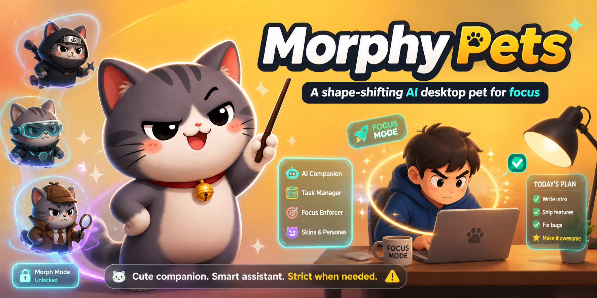

# Morphy Pets · 百变萌宠

> **一只会变身的 AI 桌面宠物，陪你专注工作。**
> Cute companion. Smart assistant. Strict when needed.

<p align="center">
  
</p>

<p align="center">
  <a href="https://www.bilibili.com/video/BV1oBR1BxEFJ" title="点击在哔哩哔哩观看介绍视频">
    
  </a>
  &nbsp;&nbsp;
  <a href="https://github.com/smile-struggler/MorphyPets/raw/main/dist/Morphy-Pets-0.1.0-mac.zip">
    
  </a>
</p>

---

## 这是什么

Morphy Pets 是一款 macOS 桌面陪伴应用（**[📺 点这里看 B 站介绍视频](https://www.bilibili.com/video/BV1oBR1BxEFJ)**，30 秒感受一下）。它把 OpenAI Codex Pets 的像素宠物"皮"借过来，配上一副能打的"骨"：

- 📅 **日历提醒** —— 读取系统日历，事件开始前让宠物提前提醒你
- 🗣️ **自然语言排程** —— "十秒后刷牙，再过 5 分钟吃饭"，一句话拆成多个日历事件
- 🧠 **摸鱼检测 + 渐进式干预** —— AX 检测前台 App / 浏览器 URL，4 级升级 (L1 气泡 → L2 卡片 → L3 屏幕中央大宠物 → L4 全屏遮罩)，每一级都能 `×`/Esc/自动超时关掉，不绑架用户
- 🎭 **LLM 人格化台词** —— 5 种预设人格 + 自定义 system prompt，流式输出边写边说，断网时自动降级到静态台词池
- 📊 **日报** —— 每天 23:00（可改）聚合当日专注/摸鱼数据，让宠物用当前人格写一段总结
- 🧩 **宠物库** —— 内置 ikun；可一键扫描 `~/.codex/pets/` 导入你自己 hatch 的 Codex 宠物，也支持任意文件夹导入，支持排序和卸载

## 快速开始（给使用者）

### 方式 A · 直接下载 .app（推荐）

1. 下载 [Morphy-Pets-0.1.0-mac.zip](https://github.com/smile-struggler/MorphyPets/raw/main/dist/Morphy-Pets-0.1.0-mac.zip)
2. 解压后把 `Morphy Pets.app` 拖到 `/应用程序`
3. **首次启动**：右键 App → "打开" → "打开"
   （Gatekeeper 会警告一次，因为没做付费公证。这是唯一的门槛。）
4. 菜单栏出现 🐾 图标后，授权日历 + 辅助功能（用于读浏览器 URL）
5. 打开设置 → LLM，填 `base URL` + `API Key` + `model`（默认占位 DeepSeek；兼容任何 OpenAI 协议：Kimi、通义、Ollama、OpenAI 本家都行）

### 方式 B · 从源码编译

需要 macOS 14+ 和 Xcode 15+（CommandLineTools 也能跑但跑不了 test）：

```bash
git clone https://github.com/smile-struggler/MorphyPets.git
cd MorphyPets
swift run MorphyPets          # 开发模式，Ctrl-C 退出
./scripts/build_app.sh --zip  # 产出 dist/Morphy Pets.app 和发布 zip
```

## 功能清单

### 🐾 宠物与动画
- 复用 Codex Pets 的 `pet.json` + spritesheet（webp/png）格式，8 列 × 9 行网格
- 动画状态机：`idle / happy / focused / nag / angry / block / sleep / walk / talk`
- **内置 6 套皮肤**（开箱即用，无需 Codex）：`ikun` / `cache-capy` / `daodun` / `mallow` / `nezuko` / `steve`
- 设置 → 宠物库：扫描导入 Codex / 文件夹导入 / 排序 / 卸载
- 想要更多皮肤？去 **[petdex.crafter.run](https://petdex.crafter.run/)** 下载，然后在设置 → 宠物库一键导入 🎨

### 📅 日历 & 自然语言排程
- EventKit 全访问 + `.EKEventStoreChanged` 订阅 + 兜底轮询（外部改日历也能感知）
- **LLM 优先**解析自然语言，一次能拆多个事件，返回 JSON 数组
- 时长估计：用户明示（"开 20 分钟的会"）优先，否则按常识（刷牙 10m、吃饭 30m、开会 60m…）
- 相对时间支持（"十秒后"、"一分钟后再过 5 分钟"），带 drift sanity check
- LLM 失败时本地 `DateComponentsFormatter` 兜底

### 🧠 摸鱼检测
- 触发：进入"专注会话"后 5s 轮询（非专注期不监控）
- 数据源：NSWorkspace 前台 app + AX 窗口标题 + 浏览器 URL (Safari/Chrome/Arc/Edge)
- 分类：本地规则 + 用户白/黑名单 + **可选**的"精细判别"（对未知网站发标题给 LLM 判断，默认关闭，避免烧 token）
- 内置 40+ 常见网站预分类（B 站娱乐、抖音、推特等划为摸鱼；GitHub、Notion、Overleaf、IDE 为工作）
- 内置工作 App 白名单：Xcode / VSCode / Cursor / JetBrains 全家桶 / Word / Figma 等 28 个 bundleID
- 自建名单：设置 → 干预模式 → 双列编辑（🐟 摸鱼 / 💼 工作），内置项也允许删除

### ⚡ 渐进式干预（4 级）

| 级别 | 触发 | 表现 | 关闭 |
| --- | --- | --- | --- |
| L1 | 分心 30s | 小气泡 + nag 动画 | 6s 自动消失 / 点宠物 |
| L2 | 90s 或第 2 次 | 放大 1.8× + 卡片（回到任务 / 5 分钟休息） | `×` / Esc / 12s |
| L3 | 持续 3 分钟 | **屏幕中央放大到最大**，半透明遮罩 + 跳跃动画 | `×` / Esc / 18s |
| L4 | 持续 5 分钟 | 每个显示器全屏遮罩 + 中央建议卡 | `×` / Esc / 30s |

- 所有时长可在设置里改
- 设置里有全局降级：`仅 L1+L2 模式` / `静音模式`
- "标记为合理使用" 把 `domain + 当前任务` 加入 24h 白名单
- 同 domain 在单 session 最多触发 2 次 L4，之后降级到 L2

### 🎭 Persona & LLM
- 5 种预设：`savage（毒舌）/ gentle（温柔）/ drillSergeant（教官）/ clown（小丑）/ calm（沉稳）`
- **自定义人格**：填自己的 system prompt
- OpenAI 兼容协议：base URL + API Key + model 任填
- 流式 SSE 输出（`AsyncThrowingStream`），宠物气泡边写边更新
- 并发安全：CheckedContinuation 队列串行化，不会 deadlock
- 设置里有 "🔌 测试连通性" 按钮
- 每种人格 × 每个干预级别都有 8 条 fallback 静态台词，断网也不崩

### 📊 日报
- 每天 23:00 自动触发（时间可改）
- 右键菜单 "🧾 总结一下"：随时手动生成
- 聚合当日 session 数据：有效专注 / 摸鱼时长 / 中断次数 / 最常分心的 app
- LLM 用当前人格写 60 字总结 + 结构化数字
- 通知中心 + `DailyReportView` 卡片两种呈现

### ⌨️ 交互
- 状态栏 🐾 图标：单击打开主菜单（开始专注 / 停止 / 排程输入 / 日报 / 设置 / 干预级别切换 / 总结一下）
- **点击宠物** = "鼓励一下"（调用 LLM 出一段鼓励台词）
- 右键宠物 = 主菜单
- 干预模式切换带 ✓ 显示当前选中

## 架构

SwiftPM 单 workspace，一个 `executable` + 6 个 `library`：

```
MorphyPets/            # App target（菜单栏 + NSPanel 浮窗）
├── MorphyPetsApp.swift
├── AppDelegate.swift
├── AppState.swift              # 全局状态 + UserDefaults 持久化
├── Focus/
│   ├── FocusController.swift       # 专注会话状态机
│   └── InterventionPresenter.swift # L1–L4 窗口调度
├── Views/
│   ├── PetOverlayWindow.swift      # 主浮窗（borderless NSPanel）
│   ├── InterventionViews.swift     # L1–L4 各级 UI
│   ├── SettingsView.swift          # 设置（通用/LLM/干预/宠物库）
│   ├── StartSessionView.swift
│   ├── ScheduleInputView.swift     # 自然语言排程输入
│   ├── DailyReportView.swift
│   └── DiagnosticsView.swift
└── Resources/Pets/ikun/        # 内置宠物

Packages/
├── PetEngine/         # pet.json 解析 + spritesheet 切帧 + PetRenderer
├── CalendarBridge/    # EventKit + NLScheduler (LLM) + LocalNLFallback
├── FocusMonitor/      # AX 前台/URL 检测 + SiteCatalog (bundled sites.json + 学习)
├── InterventionKit/   # InterventionEngine 4 级策略 + 冷却
├── PersonaLLM/        # LLMClient (OpenAI 兼容 SSE) + PersonaResponder + 静态 fallback
└── SessionStore/      # 会话/事件持久化 + 日报聚合
```

技术栈：Swift 5.9+ / SwiftUI + AppKit / EventKit / Accessibility API / `@MainActor` + actor 隔离 / `AsyncThrowingStream` / `NSPanel(borderless, nonactivating, floating)`。最低系统 macOS 14 (Sonoma)。

打包：ad-hoc 签名，universal binary (arm64 + x86_64)，资源 bundle 放 `Contents/Resources/`。由 `scripts/build_app.sh` 一键产出。

## 系统权限

首次运行会依次请求：

1. **日历** (NSCalendarsFullAccessUsageDescription) —— 读写日历事件
2. **辅助功能** (Accessibility) —— 读浏览器 URL 做摸鱼检测；拒绝也能跑，仅摸鱼检测停摆

LLM API Key 可跳过，纯本地模式仍能用 **日历提醒 + 宠物动画 + 静态台词干预**。

## 隐私

- API Key 存在本地 UserDefaults（`CyberPet.preferences.v1`，保留历史 key 以兼容老数据）
- 所有 session 数据只存本地（`~/Library/Application Support/CyberPet/`）
- 走 LLM 的只有：人格台词、NL 排程、（可选）未知网站分类、日报摘要
- 代码里没有任何 telemetry / 打点 / 上报

## 路线图

- [x] M1 骨架 + 菜单栏 + 浮窗
- [x] M2 PetEngine + Codex 宠物导入
- [x] M3 日历提醒 + 自然语言排程
- [x] M4 摸鱼检测 + 4 级干预
- [x] M5 LLM 人格 + 流式气泡
- [x] M6 会话持久化 + 日报
- [x] M7 产品包装（Morphy Pets 命名 + 自定义图标 + .app 打包）
- [ ] M8 全屏 Space 下的 L3 降级（当前实现在全屏 App 中会被系统隐藏）
- [ ] M9 Apple Developer ID 公证（免去 Gatekeeper 右键打开）

## 致谢

- [OpenAI Codex Pets](https://developers.openai.com/codex/cli/features) —— 宠物资源格式与 spritesheet 美术启发
- **[PetDex · petdex.crafter.run](https://petdex.crafter.run/)** —— 社区的宠物皮肤仓库，想要更多皮肤就去这里逛，感谢运营者持续收录 ❤️
- 内置的 6 套皮肤（`ikun` / `cache-capy` / `daodun` / `mallow` / `nezuko` / `steve`）美术 © 各自原作者，感谢社区贡献

## 许可

MIT License（见 [LICENSE](LICENSE)）。

---

<sub>有 bug / 想要的功能 / 想分享你 hatch 的宠物，欢迎 [开 Issue](https://github.com/smile-struggler/MorphyPets/issues) 或 PR。</sub>
